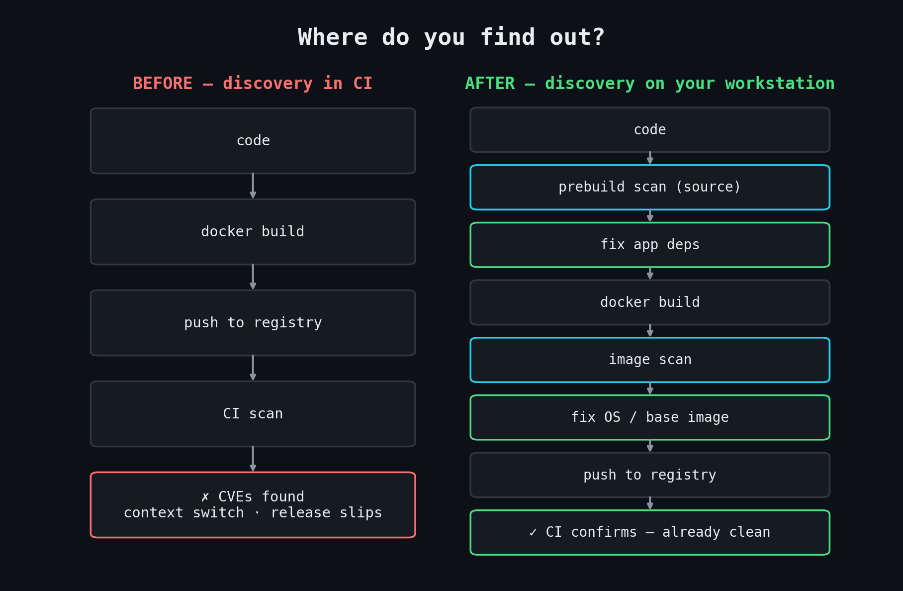
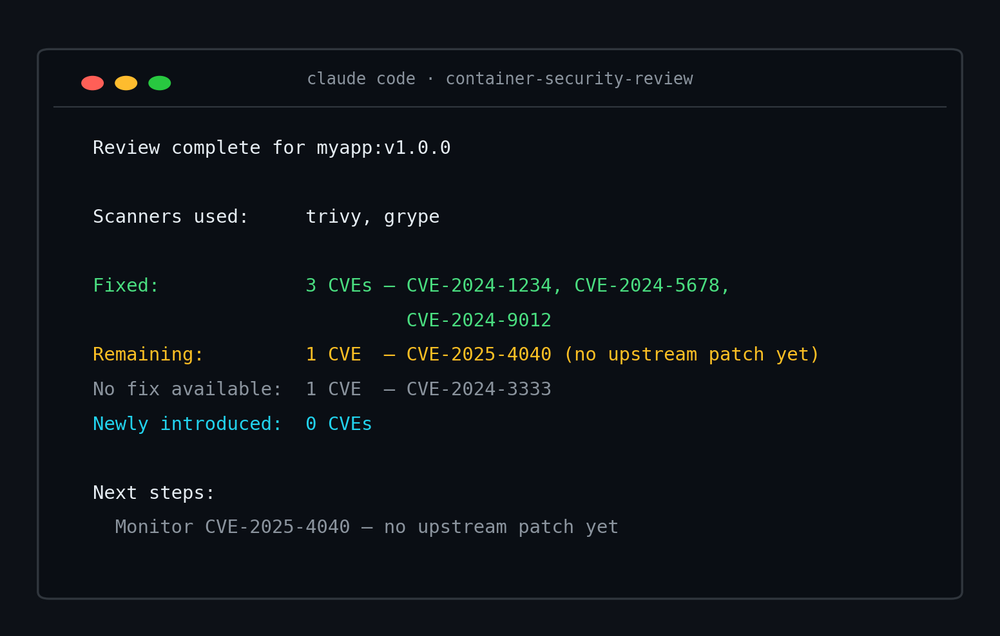
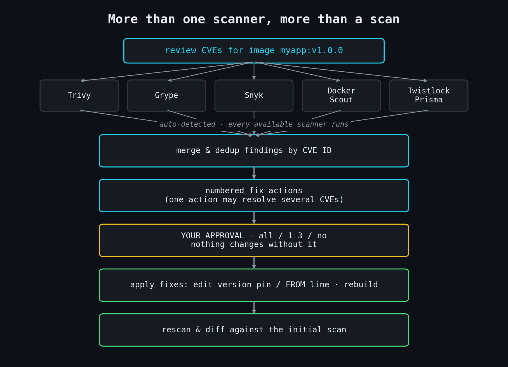
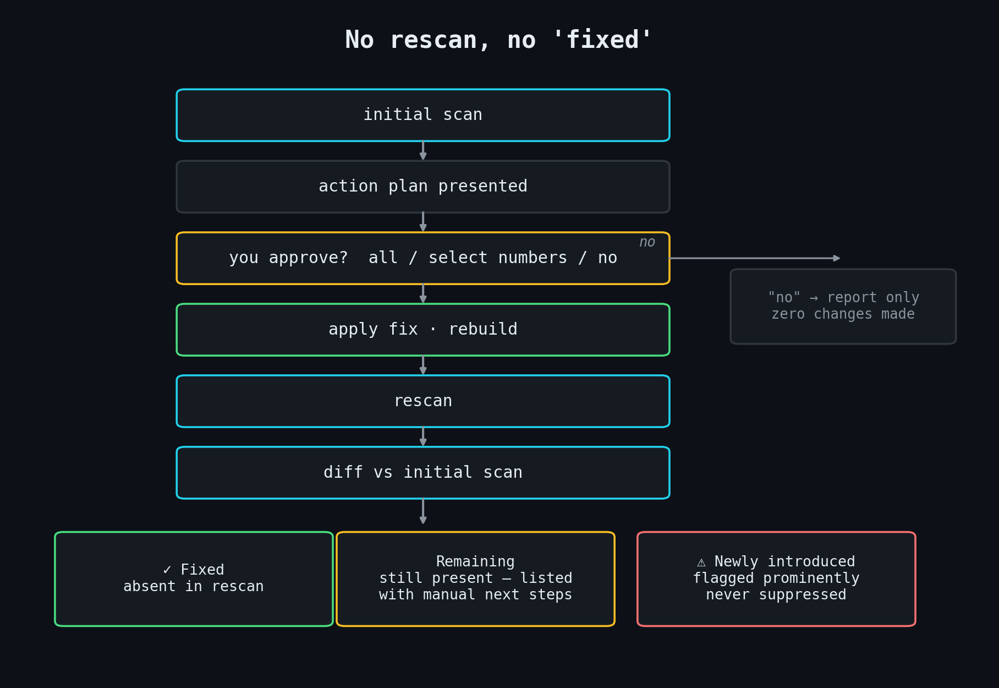
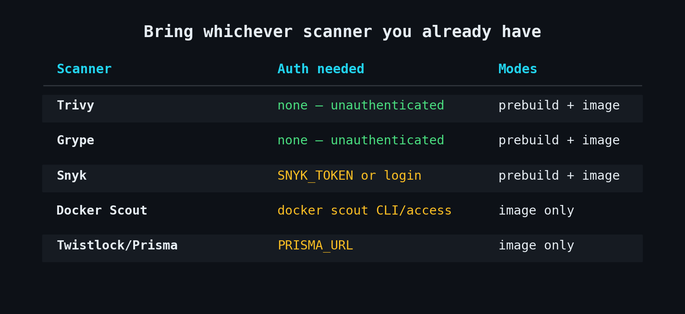
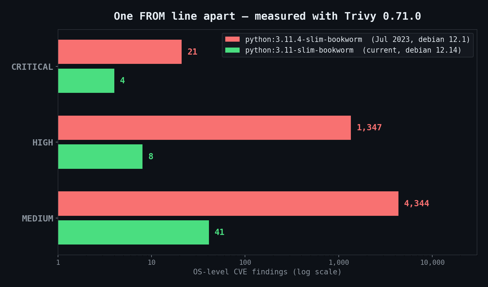

<!-- Publishing note: Medium ignores markdown image links on paste — drag each PNG
     from docs/blog/images/ into the editor at the marked spots. Captions suggested
     below each image marker. -->

# Moving Container Security Upstream: Fix CVEs Locally and Early

## Local CVE remediation with Claude Code — scan, fix, and verify before build and before push, with whichever scanner you already have installed

---

Your CI vulnerability scanner is a smoke alarm that rings after the fire.

You write the code, build the image, push to the registry — and the pipeline goes red with a wall of CVEs. By then you've switched to the next task. Now you're context-switching back, digging through CI logs to figure out which layer pulled in which package, and your release just slipped.

The scan itself was never the problem. The *timing* was. **container-security-review** moves vulnerability discovery from CI back to the developer workstation: the same class of scan, run on your workstation — before build, before push — followed by human-approved remediation and rescan verification. It ships as a Claude Code skill.


*The same pipeline, with discovery moved to where you can act on it.*

## The 30-second setup

One command, from any project where Claude Code is active:

```bash
npx skills add essentialsoft/agentskills@container-security-review
```

That's the whole installation. No config files, no YAML, no new dashboard, no new account to create.

What you need already on your machine: Node.js 18+ (for `npx`), Claude Code, and at least one mode-compatible scanner in your PATH — **Trivy, Grype, or Snyk** for prebuild source scans; any of the five supported scanners (those three plus **Docker Scout** and **Twistlock/Prisma**) for image scans. If you work with containers, odds are at least one of these is already installed. Trivy and Grype don't even need a token — they run unauthenticated out of the box.

## The demo: scan, approve, fix

You have a built image ready to push. In Claude Code, you type:

```
review CVEs for image myapp:v1.0.0
```

(A pinned tag, because that's what you'd actually push. The skill happily scans whatever tag you give it — though as you'll see below, it holds *itself* to a stricter standard when recommending replacements.)

Here's what happens, mechanically. The skill detects you're in image mode, confirms the image is accessible, then probes for scanners in order: Trivy → Snyk → Grype → Docker Scout → Twistlock/Prisma. Image scans probe all five; prebuild scans skip Scout and Prisma automatically, since they have no source-directory scan mode. Every scanner it finds and can authenticate, it runs. Then it reads each scanner's JSON output and merges the findings by CVE ID — if Trivy and Grype both flag the same vulnerability, you see it once, not twice.

What lands in front of you is not a 400-line log. It's a numbered action plan, where each action is one concrete fix that may resolve several CVEs at once:

```
CVE Review — myapp:v1.0.0
Scanners used: trivy, grype

CRITICAL / HIGH — Action Required (2 fix actions, resolves 3 CVEs)

[1] BASE IMAGE UPDATE · resolves CVE-2024-1234, CVE-2024-5678
    Current: python:3.11.4-slim-bookworm
    → Recommend: python:3.11-slim-bookworm (fewer CRITICAL/HIGH, same distro family)

[2] CVE-2024-9012 · HIGH · App · requests 2.28.0 · requirements.txt
    Fixed in: 2.32.0
    → pip: bump pin to requests==2.32.0

[3] CVE-2024-3333 · HIGH · OS · no fix available
    (listed for awareness — no action possible)

MEDIUM / LOW — For Awareness (table follows)

Proceed with the action plan above? (all / select numbers / no)
```

*(CVE IDs and counts illustrative.)*

You answer `all`, pick specific numbers (`1 3`, `1-2`), or say `no` to get the report with zero changes made. Only after you confirm does anything get touched: the skill edits the `FROM` line in your Dockerfile or the version pin in your manifest, rebuilds the image, and rescans. When everything finishes:


*The completion report: what got fixed, what remains, what's new — with CVE IDs (illustrative).*

That whole loop — scan, triage, approve, fix, verify — happens before your registry ever sees the image.

## Why this isn't just "run Trivy"

Fair question: `trivy image myapp:v1.0.0` already works, and it's one command. But a scanner invocation gives you a findings list — everything *after* the findings list is still on you. The skill owns that second half: it consolidates every compatible scanner on your machine, deduplicates by CVE ID, turns raw findings into numbered fix actions, applies the ones you approve, verifies each via rescan, and tracks anything newly introduced.


*One findings list in, verified fixes out — with your approval as the gate in the middle.*

The scanner is the smoke detector. This is the part that puts the fire out and then walks the building to make sure nothing else caught.

## Why it's easy to trust

**It checks whether the fix made things worse.** The biggest fear with any automated remediation is that upgrading one library silently pulls in three new vulnerable dependencies. So after every fix that applies and builds successfully, the skill rescans and diffs the result against the initial scan. Anything that appears in the rescan but wasn't there before is reported under **Newly introduced** — flagged prominently, never suppressed, with an explicit instruction to investigate before pushing. Regressions don't get to hide.

**Nothing changes without your approval.** The action plan is a hard gate. Until you answer that `all / select numbers / no` prompt, the skill is read-only. Answer `no` and you get a complete findings report — useful on its own as a remediation ticket for whoever owns the source.

**"Fixed" requires evidence.** The skill never claims a CVE is resolved just because it edited a file. A CVE counts as fixed only when it's absent from a rescan of the rebuilt image or rescanned source. No rescan, no claim.

**No new accounts, no new service.** The skill is an orchestrator for scanner CLIs already on your machine — it doesn't add another SaaS subscription to your stack. With Trivy or Grype, no scanner authentication is involved at all; the service-backed scanners simply run under the vendor accounts you already have.

**Local doesn't mean stale.** Trivy automatically fetches and maintains its vulnerability database as needed, and Grype checks for database updates by default. Service-backed scanners such as Snyk, Docker Scout, and Prisma use their vendor-backed vulnerability intelligence as they normally would. In most environments, a workstation scan is using the same kind of continuously updated vulnerability data your CI scanner relies on.

The exception is air-gapped or tightly controlled networks. If database updates are restricted, make refreshes part of your workflow (`trivy image --download-db-only`, `grype db update`) so your findings reflect current vulnerability data rather than an old local cache.


*The trust model in one picture: a CVE is only "fixed" when the rescan says so, and regressions can't hide.*

## It works with what you already have


*Trivy and Grype run with zero auth; Scout and Prisma are image-mode only.*

No scanner preference? Auto-detect finds what's installed. Loyal to one? Say `use Trivy` and the skill uses exactly that scanner — it never silently substitutes another.

The two modes cover both halves of the shift-left story:

```
prebuild scan → fix app deps → docker build → image scan → fix OS/base → push
```

The split matters because vulnerabilities arrive in two waves. Library CVEs live in your manifests — `requirements.txt`, `package.json`, `go.mod` — and you can catch and fix those *before* you spend time building an image (no Docker required). OS and base-image CVEs are handled in image mode, once layers are assembled — so the image scan catches that second wave right after build, while a `FROM`-line fix is still a one-line change away from a clean push.

How much can that one-line `FROM` fix matter? Here's a real measurement I took while writing this post (June 11, 2026 — Trivy 0.71.0, `trivy image <tag>` against each tag with that day's vulnerability DB), comparing a mid-2023 pinned Python base against the current patch tag of the *same* minor version and distro:


*Not a simulation — Trivy 0.71.0 against both tags, OS-level findings, log scale.*

Same Python, same Debian family, one `FROM` line apart. That is exactly the class of fix the skill proposes, applies, and rescan-verifies in image mode.

One detail that shows where this tool's head is at: when the skill hunts for a safer base image to recommend, it discards `latest`, `-rc`, and `-beta` tags outright and only considers candidates in the same distro family as your current base. It's built for production environments where deterministic, pinned tags matter — not for sandbox demos.

## Where it stops

Honest limits, so you know what you're getting:

- **No upstream fix, no fix.** If a CVE has no fixed version published, the skill reports it under "No fix available" — it won't pretend, and it won't hide it.
- **It edits pins and `FROM` lines, not your application code.** If a dependency bump involves breaking API changes, adapting your code to them is still your job — the rescan tells you the CVE is gone, not that your test suite passes.
- **Base image upgrades may need manual validation.** Candidates are filtered to the same distro family and pinned tags, but confirming your app behaves on the new base remains on you.
- **Image-only environments are report-only.** With no Dockerfile or source on disk, you get the full findings report and action plan to hand to the source owner — no automated fixes.

## Get started

```bash
npx skills add essentialsoft/agentskills@container-security-review
```

Then, from your project in Claude Code:

```
scan my source for CVEs        ← before build
review CVEs for image <tag>    ← before push
```

Run them in sequence and the fire alarm rings while the stove is still in front of you.

The goal isn't to replace your CI scanner. It's to turn CI from the place you *discover* vulnerabilities into the place you *confirm* they're gone.

Skill source, docs, and the full reference set: [github.com/essentialsoft/agentskills](https://github.com/essentialsoft/agentskills)
